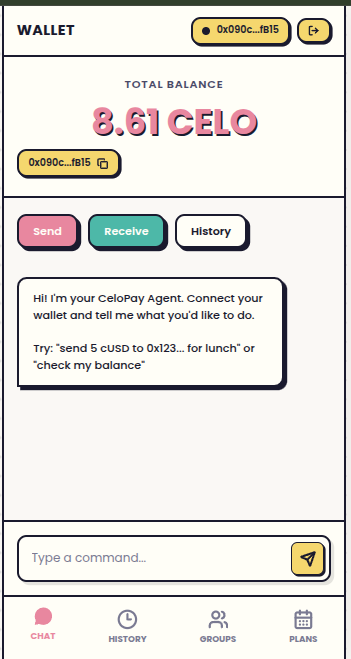
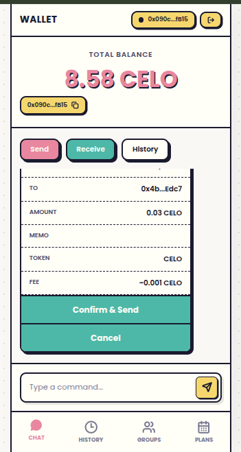
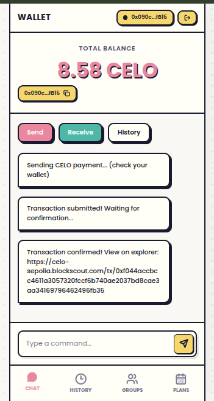
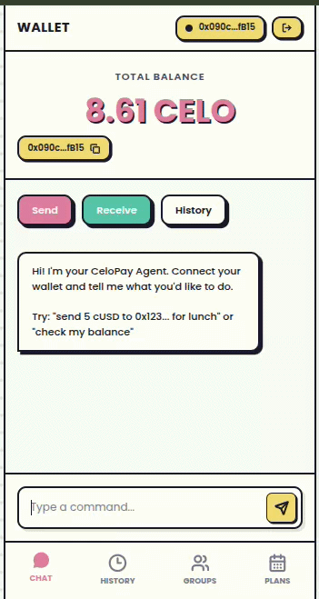
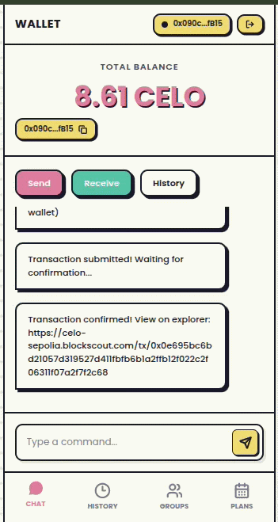

# CeloAgentPay

## About the Project

CeloAgentPay is an AI-powered payment agent for on-chain transactions on Celo, designed to be as simple as having a conversation. Users just type a command in natural language — e.g. "send 5 cUSD to 0x123... for lunch" — and the agent interprets the intent and triggers the corresponding transaction on the Celo network.

This project was built to make blockchain payments accessible to everyone without requiring any technical knowledge. The AI handles intent parsing, token and amount selection, and transaction construction, while the interface stays as simple as a chat window.

## Live Demo & Links

- Live: https://celoagentpay.vercel.app/
- Repository: https://github.com/hendrakrnm/celoagentpay
- Contracts on Celo Mainnet: see Contract Address section below

## Contract Address

Network: Celo Mainnet (Chain ID: 42220)

- [0x704e43496d7e6599d83d7f21a4dd435bc458c9c1](https://celoscan.io/address/0x704e43496d7e6599d83d7f21a4dd435bc458c9c1)
- [0x43c12cf7ace0de26d9dae4c6d82b5b594b521944](https://celoscan.io/address/0x43c12cf7ace0de26d9dae4c6d82b5b594b521944)
- [0x8e21a22e99b48e4e665df068c6e621d598da77b0](https://celoscan.io/address/0x8e21a22e99b48e4e665df068c6e621d598da77b0)

## How It Works & How to Use

1. Connect a Celo-compatible wallet (MetaMask, WalletConnect, etc.) to Celo Mainnet (Chain ID: 42220).
2. Type a command in the chat box, e.g. "send 2 CELO to 0x..." or "check my balance".
3. Confirm the transaction in your wallet when the agent constructs the on-chain transaction.
4. View transaction history and status in the History tab.

## Screenshots & Demo

- Home page: 
- Interaction: 
- Flow overview: 
- GIF demo (chat → send): 
- GIF additional features: 

## Advantages & Why Celo

- **Natural language UX** — no forms, no manual address entry, no token selection dropdowns. Users describe what they want in plain English and the agent handles the rest, dramatically lowering the barrier to on-chain payments.
- **AI-powered intent parsing** — the agent understands context, resolves ambiguity, and confirms details before executing, reducing user error in irreversible blockchain transactions.
- **Verifiable on-chain execution** — every transaction triggered by the agent is real and verifiable on Celoscan, not simulated or abstracted away.
- **Low gas fees on Celo** — micro-transactions and frequent payments are economically viable, making the chat-based payment flow practical for everyday use.
- **Mobile-first and accessible** — Celo's ecosystem and MiniPay compatibility means CeloAgentPay can reach users who are new to crypto without overwhelming them with technical complexity.
- **Stablecoin ready** — native support for cUSD and CELO makes it easy to send value without worrying about price volatility during the transaction flow.

## Tech Stack

- **Frontend:** Next.js (App Router), React, wagmi
- **Smart Contracts:** Solidity, Foundry
- **Blockchain:** Celo Mainnet (Chain ID: 42220)
- **AI:** OpenRouter / OpenAI (server-side agent endpoint)
- **Hosting / CI:** Vercel

## Roadmap / Next Steps

- Multi-wallet support and mobile UX improvements.
- Smart contract audit and gas optimizations.
- Multi-network support (testnet preview + mainnet toggle in UI).
- Enhanced AI intent handling: batch payments, scheduled transfers, and natural language confirmations.